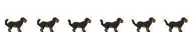

# snor-oh Swift

A native macOS desktop mascot that reacts to your terminal and [Claude Code](https://docs.anthropic.com/en/docs/claude-code) activity in real-time. Built with SwiftUI + SwiftNIO.

A pixel dog floats on your screen, watching what you do: running commands turns it busy, finishing tasks makes it celebrate, and idle time puts it to sleep. It discovers nearby peers on your local network and can visit them.

<p align="center">
  
</p>

## Requirements

- macOS 14.0 (Sonoma) or later
- [Node.js](https://nodejs.org/) (for MCP server, used by Claude Code integration)
- Swift 5.9+ (only for building from source)

## Installation

### From DMG

1. Download `snor-oh-0.1.0.dmg` from the [Releases](https://github.com/vietnguyenhoangw/snor-oh-swift/releases) page
2. Open the DMG and drag **snor-oh** to Applications
3. Launch snor-oh from Applications
4. On first launch, the setup wizard will configure everything automatically

### From Source

```bash
git clone https://github.com/vietnguyenhoangw/snor-oh-swift.git
cd snor-oh-swift

# Development
swift build
swift run

# Release build (.app bundle)
bash Scripts/build-release.sh
# Output: .build/release-app/snor-oh.app

# Create DMG
hdiutil create -volname "snor-oh" \
  -srcfolder .build/release-app/snor-oh.app \
  -ov -format UDZO .build/release-app/snor-oh-0.1.0.dmg
```

## First Launch Setup

When you launch snor-oh for the first time, the setup wizard runs automatically:

1. **MCP Server** - Installs the Claude Code MCP server to `~/.snor-oh/mcp/`
2. **Claude Code Hooks** - Configures hooks in `~/.claude/settings.json` so Claude Code activity triggers mascot animations
3. **Setup Marker** - Writes `~/.snor-oh/setup-done` to skip the wizard on subsequent launches

On later launches, the MCP server is silently updated and hooks are migrated if needed.

## Shell Integration (Terminal Monitoring)

To make the mascot react to your terminal commands, source the appropriate hook script in your shell config:

### Zsh (`~/.zshrc`)

```bash
source /Applications/snor-oh.app/Contents/Resources/Scripts/terminal-mirror.zsh
```

### Bash (`~/.bashrc`)

```bash
source /Applications/snor-oh.app/Contents/Resources/Scripts/terminal-mirror.bash
```

### Fish (`~/.config/fish/config.fish`)

```fish
source /Applications/snor-oh.app/Contents/Resources/Scripts/terminal-mirror.fish
```

> If you built from source, replace `/Applications/snor-oh.app` with the path to your built `.app` bundle.

### What the Shell Hooks Do

- **Command starts** (`preexec`) - Sends `state=busy` to the mascot. Long-running dev servers (`start`, `dev`, `serve`, `watch`) are classified as `service` (brief blue flash).
- **Command ends** (`precmd`) - Sends `state=idle`, mascot returns to idle animation.
- **Heartbeat** - Background `curl` every 20 seconds keeps the session alive. Sessions without a heartbeat for 40 seconds are removed.
- **Multi-session** - Each terminal gets its own session (tracked by PID). The sidebar shows per-project status.

## Claude Code Integration

snor-oh integrates with Claude Code via two mechanisms:

### MCP Server (Bidirectional)

Claude Code can talk to your mascot through the MCP server:

| Tool | Description |
|------|-------------|
| `pet_say` | Show a speech bubble with a message |
| `pet_react` | Trigger a reaction animation (celebrate, excited, nervous, confused, sleep) |
| `pet_status` | Get current mascot status, session info, and usage stats |

The MCP server is registered in `~/.claude.json` under `mcpServers.snor-oh`.

### Hooks (Claude Code -> Mascot)

Claude Code hooks in `~/.claude/settings.json` notify the mascot on:

| Event | Action |
|-------|--------|
| `PreToolUse` | Mascot goes busy |
| `UserPromptSubmit` | Mascot goes busy |
| `Stop` | Mascot returns to idle |
| `SessionStart` | Mascot returns to idle |
| `SessionEnd` | Mascot returns to idle |

## Usage

### Tray Icon

- **Left-click** - Toggle mascot visibility
- **Right-click** - Context menu (Show, Settings, Quit)

### Settings (Cmd+,)

| Tab | Options |
|-----|---------|
| **General** | Theme (dark/light/system), glow effect, speech bubbles, auto-start at login, hide dock icon, tray icon visibility |
| **Mime** | Nickname, display scale (0.5x-2x), pet selection (4 built-in + custom), import/export `.snoroh` files, delete custom pets |
| **About** | Version info, GitHub link, dev mode (10-click secret) |

### Built-in Pets

| Pet | Frame Size |
|-----|-----------|
| Rottweiler | 64px |
| Dalmatian | 64px |
| Samurai | 128px |
| Hancock | 128px |

### Custom Pets

Create custom pets from any sprite sheet PNG:

1. Open Settings > Mime tab
2. Click the **+** card in the pet grid
3. Load a sprite sheet image
4. The Smart Import pipeline auto-detects frames:
   - Detects background color from 4 corners
   - Removes background (sets to transparent)
   - Scans for rows (horizontal transparent gaps)
   - Scans for columns within each row (3-pass: detect, bridge gaps, absorb slivers)
5. Assign frame ranges to each status (idle, busy, service, etc.)
6. All frames are normalized to 128x128px grid strips

Custom pets are stored at:
- Metadata: `~/.snor-oh/custom-mimes.json`
- Sprites: `~/.snor-oh/custom-sprites/`

Export/import custom pets as `.snoroh` files (JSON with base64-encoded PNGs).

## Multi-Session & Projects

When multiple terminals are open, the sidebar shows a per-project view:

- Each terminal session is tracked by PID + working directory
- Sessions in the same `cwd` are grouped into a project
- Project status = highest priority session: **busy > service > idle**
- Git status (modified file count) is polled every 30 seconds per project

### Status Priority

| Status | Priority | Color | Meaning |
|--------|----------|-------|---------|
| Busy | 4 | Red | Command running |
| Service | 3 | Blue | Dev server (auto-reverts to idle after 2s) |
| Idle | 2 | Green | Waiting for input |
| Disconnected | 0 | Gray | No active sessions |
| Sleeping | - | Gray | Idle for 2+ minutes |

## Peer Discovery (LAN)

snor-oh discovers other instances on your local network via Bonjour:

- Service type: `_snor-oh._tcp`
- TXT records: `nickname`, `pet`, `port`
- Peers appear in the sidebar with their pet sprite and nickname
- Click a peer to "visit" them (your pet appears on their screen for 15 seconds)

## HTTP API

Local HTTP server on `127.0.0.1:1234`:

| Endpoint | Method | Description |
|----------|--------|-------------|
| `/status?pid=X&state=busy\|idle&type=task\|service&cwd=PATH` | GET | Update session status |
| `/heartbeat?pid=X&cwd=PATH` | GET | Keep session alive |
| `/visit` | POST | Send a visit (JSON body) |
| `/visit-end` | POST | End a visit (JSON body) |
| `/mcp/say` | POST | Speech bubble `{"message":"...", "duration_secs":7}` |
| `/mcp/react` | POST | Reaction `{"reaction":"celebrate", "duration_secs":3}` |
| `/mcp/pet-status` | GET | Full status JSON |
| `/debug` | GET | Plain text state dump |

## File Structure

```
~/.snor-oh/
  setup-done                    # First-launch marker
  mcp/server.mjs               # MCP server (updated on each launch)
  custom-mimes.json             # Custom pet metadata
  custom-sprites/               # Custom pet PNG sprite strips
    custom-<UUID>-idle.png
    custom-<UUID>-busy.png
    ...
```

## Development

```bash
# Build & run
swift build && swift run

# Run tests (19 SessionManager tests)
swift test

# Generate Xcode project (requires xcodegen)
xcodegen generate
open SnorOhSwift.xcodeproj

# Type check
swift build 2>&1 | head -5
```

### Architecture

```
Shell hooks (curl) --> HTTP :1234 --> SessionManager --> SwiftUI Views
Claude Code <--stdio--> MCP server (Node.js) <--HTTP--> :1234 --> SwiftUI Views
Bonjour (NWBrowser/NWListener) --> PeerDiscovery --> SessionManager --> SidebarView
```

| Module | Files | Responsibility |
|--------|-------|---------------|
| Core | Types, SessionManager, Watchdog, HTTPServer | State management, HTTP API |
| App | SnorOhApp, AppDelegate | Lifecycle, menu bar, window management |
| Animation | SpriteConfig, SpriteCache, SpriteEngine | Sprite sheets, frame extraction, animation |
| Sprites | CustomMimeManager, SmartImport, MimeExporter | Custom pet CRUD, sprite sheet processing |
| Views | MascotWindow/View, StatusPill, SpeechBubble, Sidebar, Settings, Setup | UI layer |
| Network | GitStatus, PeerDiscovery, VisitManager | Git polling, Bonjour, peer visits |
| Setup | MCPInstaller, ClaudeHooks | First-launch configuration |
| Util | Logger, Defaults | Logging, UserDefaults keys |

## License

MIT
